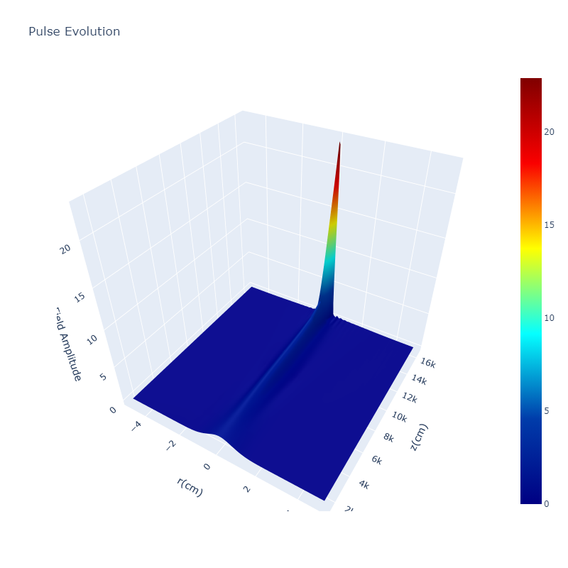
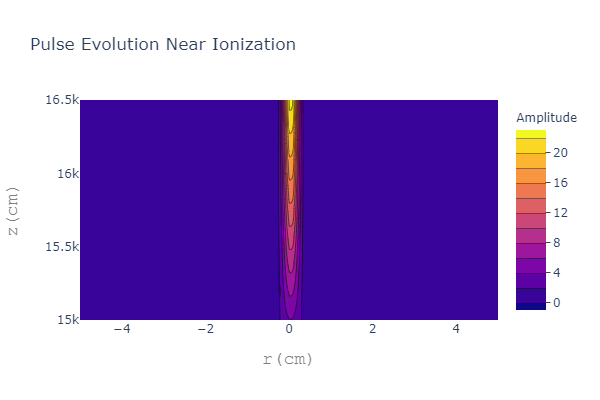
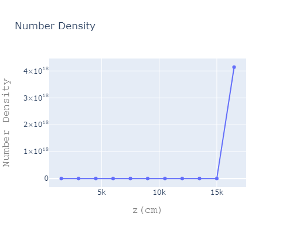

# Short Pulse Laser Propagation in Atmosphere by Using Split Step Fourier Method

This code simulates the short pulses propagating in the atmosphere by using split step Fourier method and Python. The code used in that repo implemented from [jeovazero/split-step-fourier-method-python](https://github.com/jeovazero/split-step-fourier-method-python)

## Propagation Equation Source Elements:
Source components used in propagation equations are
* Plasma source term
* Bound source term
* Ionization source term

## Dependencies:
* Numpy
* Plotly
* Scipy

## Simulations:

## References:
* Sprangle *et al* Propagation of intense short laser pulses in the atmosphere
